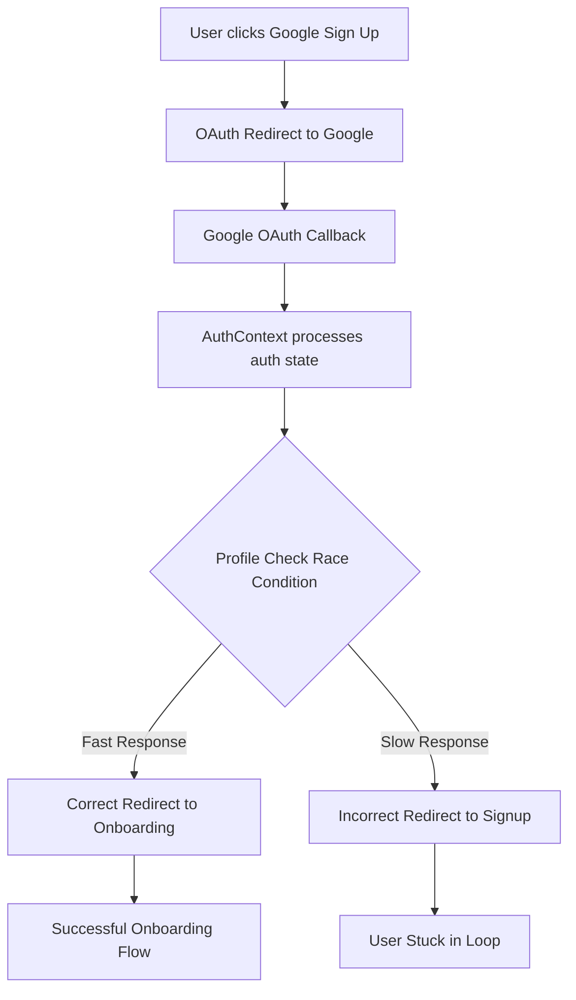
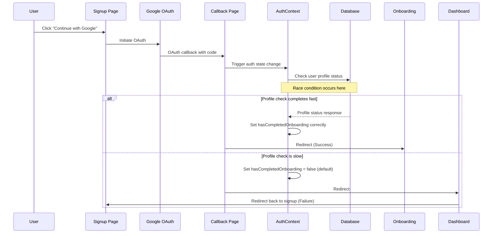
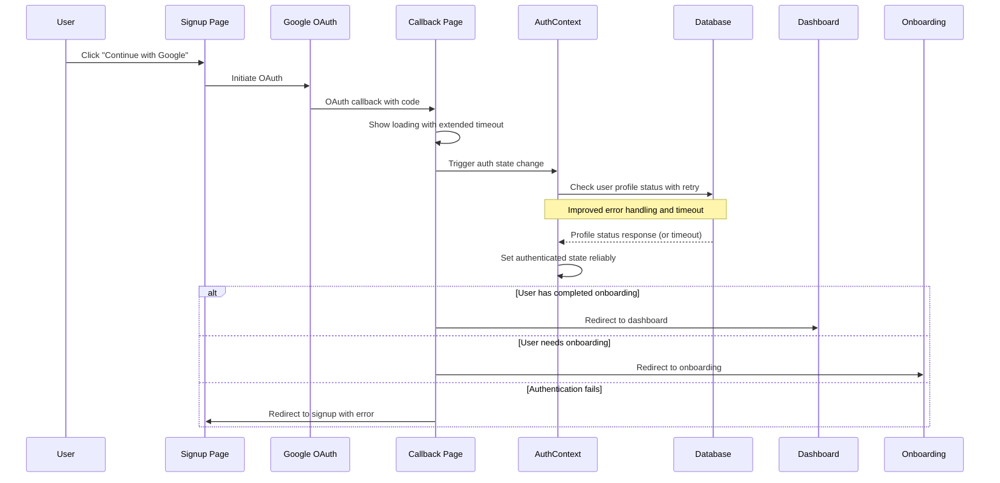

# Signup Redirect Fix Design

## Overview

This design addresses a critical authentication flow issue where new users experience a race condition during Google OAuth signup. Users see "completing sign up" loading state, then get redirected back to the signup screen unless they manually refresh the page before reaching onboarding.

**Root Cause**: Race condition between authentication state changes, profile status checks, and page redirections in the OAuth callback flow.

**Impact**: Poor user experience for new signups, potential user abandonment during critical onboarding flow.

## Architecture

The current authentication flow involves multiple components with interdependent state management:



### Current State Management Issues

| Component | Current Issue | Impact |
|-----------|---------------|---------|
| **AuthContext** | Multiple rapid state changes during OAuth | User object becomes temporarily inconsistent |
| **Auth Callback Page** | Insufficient timeout for authentication completion | Premature redirects to login/signup |
| **Profile Status Check** | Database query timing inconsistency | `hasCompletedOnboarding` incorrectly determined |
| **Signup Page useEffect** | Immediate redirect on auth state change | Interrupts OAuth completion |

## Data Flow Analysis

### Current Problematic Flow



### Target Improved Flow



## Component Architecture Updates

### 1. Enhanced Authentication State Management

```typescript
interface AuthState {
  user: User | null;
  isLoading: boolean;
  isProfileLoading: boolean;
  authenticationStage: 'idle' | 'oauth_callback' | 'profile_check' | 'complete';
  profileError: string | null;
}
```

### 2. Improved Auth Callback Component

**Current Issues:**
- 15-second timeout insufficient for profile checks
- No retry mechanism for failed profile queries
- Premature redirects during authentication processing

**Proposed Enhancements:**
- Extended timeout with progressive loading indicators
- Retry mechanism for profile status checks
- Better error state handling with user feedback options

### 3. Profile Status Verification Strategy

**Current Implementation Problems:**
- Single database query without retry
- Default `hasCompletedOnboarding = false` on errors
- No differentiation between "new user" and "database error"

**Improved Strategy:**
- Multi-step verification with fallback logic
- Retry mechanism with exponential backoff
- Explicit error states for better user experience

## Authentication Flow Enhancements

### Phase 1: Callback Page Improvements

1. **Extended Loading State**
   - Increase timeout from 15s to 30s
   - Progressive loading messages
   - Visual progress indicators

2. **Profile Check Retry Logic**
   ```typescript
   const checkProfileWithRetry = async (userId: string, maxRetries = 3) => {
     for (let attempt = 1; attempt <= maxRetries; attempt++) {
       try {
         const result = await checkProfileStatus(userId);
         return result;
       } catch (error) {
         if (attempt === maxRetries) throw error;
         await delay(1000 * attempt); // Exponential backoff
       }
     }
   };
   ```

3. **Better Error Recovery**
   - Distinguish between network errors and user state issues
   - Provide user-actionable error messages
   - Fallback to manual refresh option

### Phase 2: AuthContext Optimization

1. **Staged Authentication Process**
   ```typescript
   enum AuthStage {
     IDLE = 'idle',
     OAUTH_CALLBACK = 'oauth_callback',
     PROFILE_CHECK = 'profile_check',
     COMPLETE = 'complete'
   }
   ```

2. **Profile Status Caching**
   - Cache profile status for 5 minutes
   - Reduce redundant database queries
   - Improve response times for returning users

3. **State Synchronization**
   - Ensure profile status consistency across components
   - Prevent race conditions in state updates
   - Better handling of concurrent auth state changes

### Phase 3: Signup Page Protection

1. **OAuth State Tracking**
   - Track ongoing OAuth processes
   - Prevent duplicate OAuth initiations
   - Better handling of back/forward navigation

2. **Loading State Management**
   - Maintain loading state during OAuth flow
   - Disable signup button during processing
   - Clear error states appropriately

## Error Handling Strategy

### Error Categories

| Error Type | Current Handling | Improved Handling |
|------------|------------------|------------------|
| **Network Timeout** | Redirect to login | Retry with user notification |
| **Profile Not Found** | Set onboarding = false | Explicit new user flow |
| **Database Error** | Set onboarding = false | Show error with retry option |
| **OAuth Failure** | Generic error message | Specific error with guidance |

### User Experience Improvements

1. **Progressive Loading States**
   ```
   "Completing sign in..." (0-5s)
   "Setting up your profile..." (5-15s)
   "Almost ready..." (15-25s)
   "Taking longer than expected..." (25-30s)
   ```

2. **Error Recovery Options**
   - "Try Again" button for transient errors
   - "Contact Support" for persistent issues
   - "Manual Refresh" as fallback option

3. **Fallback Mechanisms**
   - Local storage for auth state persistence
   - Manual profile check trigger
   - Alternative authentication methods

## Testing Strategy

### Unit Tests

1. **AuthContext State Management**
   - Test profile check retry logic
   - Verify state transitions during OAuth
   - Test error handling scenarios

2. **Callback Page Logic**
   - Test timeout handling
   - Verify redirect logic for different user states
   - Test error recovery mechanisms

### Integration Tests

1. **Complete OAuth Flow**
   - New user signup end-to-end
   - Existing user login verification
   - Error scenario handling

2. **Race Condition Simulation**
   - Slow database response scenarios
   - Network interruption handling
   - Concurrent auth state changes

### Load Testing

1. **Database Query Performance**
   - Profile status check response times
   - Concurrent user authentication
   - Database connection pooling efficiency

## Implementation Phases

### Phase 1: Immediate Fixes (High Priority)
- [ ] Extend auth callback timeout to 30 seconds
- [ ] Add retry logic for profile status checks
- [ ] Improve loading state messaging
- [ ] Add error recovery options

### Phase 2: State Management Improvements (Medium Priority)
- [ ] Implement authentication stage tracking
- [ ] Add profile status caching
- [ ] Improve state synchronization across components
- [ ] Enhanced error categorization

### Phase 3: User Experience Enhancements (Lower Priority)
- [ ] Progressive loading indicators
- [ ] Better error messaging and guidance
- [ ] Fallback authentication methods
- [ ] Performance optimizations

## Security Considerations

1. **Session Management**
   - Secure token handling during OAuth flow
   - Proper session timeout handling
   - Prevention of session fixation attacks

2. **Error Information Disclosure**
   - Avoid exposing sensitive error details
   - Generic error messages for security failures
   - Proper logging without data leakage

3. **State Validation**
   - Verify authentication state before redirects
   - Validate profile data integrity
   - Prevent unauthorized access during state transitions

## Monitoring and Observability

### Key Metrics

1. **Authentication Success Rate**
   - OAuth completion percentage
   - Profile check success rate
   - Time to successful authentication

2. **Error Tracking**
   - Timeout occurrence frequency
   - Profile check failure reasons
   - User abandonment points

3. **Performance Metrics**
   - Database query response times
   - Authentication flow completion time
   - Retry mechanism effectiveness

### Logging Strategy

1. **Debug Information**
   - Authentication stage transitions
   - Profile check attempts and results
   - Error conditions and recovery actions

2. **User Experience Tracking**
   - Time spent in loading states
   - Error recovery success rates
   - User journey completion rates